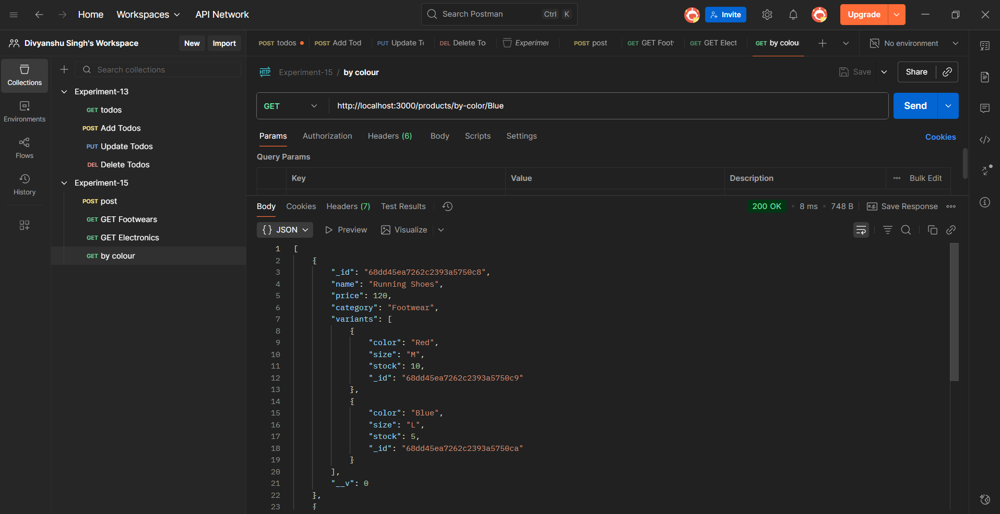
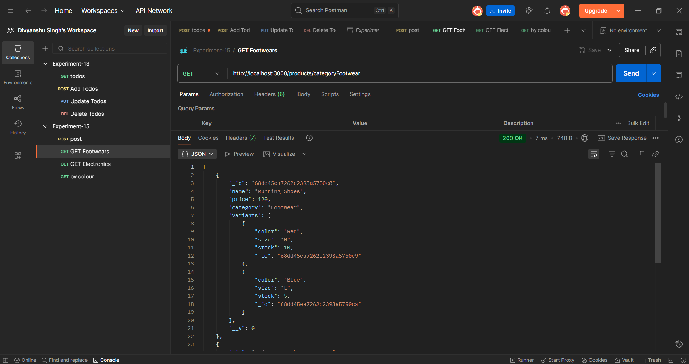

# 🛒 Experiment 15 – E-commerce Catalog using MongoDB (MVC Structure)

## 🎯 Objective
To design and implement a **MongoDB data model** for an **E-commerce catalog** using **MVC architecture** in Node.js.  
This project demonstrates how to use **nested documents** in MongoDB to represent products and their variants, and how to perform filtering and retrieval operations via REST APIs.

---

## 🧩 Project Structure


Experiment-15/
│
├── controllers/
│   └── productController.js      # Handles business logic for product operations
│
├── models/
│   └── productModel.js           # Defines MongoDB product schema
│
├── routes/
│   └── productRoutes.js          # Handles API routing
│
├── server.js                     # Entry point of the application
│
├── package.json
│
└── OUTPUTS/                      # Contains output screenshots
    ├── 1.png
    ├── 2.png
    ├── 3.png
    ├── 4.png
    └── 5.png
```

---

## ⚙️ Technologies Used
- **Node.js**  
- **Express.js**  
- **MongoDB + Mongoose**  
- **Postman** (for API testing)

---

## 🧠 Features Implemented
✅ Add multiple products with multiple variants (color, size, stock)  
✅ Fetch all products  
✅ Filter products by **category**  
✅ Filter products by **color** (shows only matching color variants)  
✅ RESTful API structure using **MVC pattern**

---

## 🚀 API Endpoints

| Method | Endpoint | Description |
|--------:|-----------|--------------|
| **POST** | `/products` | Add one or more new products |
| **GET** | `/products` | Retrieve all products |
| **GET** | `/products/category/:category` | Get products by category |
| **GET** | `/products/by-color/:color` | Get products filtered by color |

---

## 📸 Output Screenshots

### 🧾 1️⃣ Fetch All Products


---

### 👟 2️⃣ Filter by Color (Blue)


---

## 🧩 Sample Product Data (JSON)
```json
[
  {
    "name": "Running Shoes",
    "price": 120,
    "category": "Footwear",
    "variants": [
      { "color": "Red", "size": "M", "stock": 10 },
      { "color": "Blue", "size": "L", "stock": 5 }
    ]
  },
  {
    "name": "Smartphone",
    "price": 699,
    "category": "Electronics",
    "variants": [
      { "color": "Black", "size": "Standard", "stock": 15 },
      { "color": "Silver", "size": "Standard", "stock": 20 }
    ]
  }
]


------------------------------------------------------------------------------------------
Learning Outcome

Understood how to design nested MongoDB schemas.

Learned to use Mongoose models in MVC pattern.

Implemented Express routes for RESTful API handling.

Gained practical experience using Postman to test CRUD APIs.